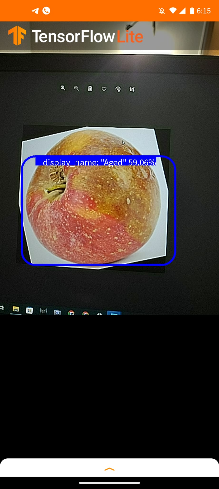

**GROUP 1**

**Ashutosh Tripathi**

**Abhay Tyagi**

**Manohar Rajawat**

## **Fruit Defect Detection System:**

### INTRODUCTION- This project is based on the principal of Fruit Defect Detection. In this system using a image our model can predict the type of defect on the fruit.
- Based on follwing classes.
- Aged
- Diseased
- Fresh
- Damaged
- Insect

### 1.1 **Generate New Version**: This Proposal will take some defective fruit images caused because of Insects, Bruises, Diseases as train and test data for input.

1.1.1 **Source Images: Number of Images are 1160**
- Images-It will show the number of images we are using to train our dataset.
- Classes-It will show the number of clases we are using for image identification.
- Unannotated-It will show the number of unannotated images for classification.

1.1.2 **Train/Test Split:**
- Training Set-Here, we are spliting training set as 70%.
- Validation Set-Here, we are spliting training set as 20%
- Testing Set-Here, we are spliting training set as 10%

1.1.3. **Preprocessing:**

- Auto-Orient: Applied
- Resize: Stretch to 416x416
- Modify Classes: 0 remapped

1.1.4. **Augmentations:**
- Outputs per training example: 3
- Flip: Horizontal, Vertical
- Rotation: Between -21° and +21°
- Brightness: Between -40% and +40%
- Bounding Box: Flip: Horizontal
- Bounding Box: Rotation: Between -15° and +15°

1.1.4. **Generate:**
- Version Name: FDD
- Version ID: 3
- Generated: Dec 1, 2021
- Annotation Group: testing-group0f3

### 2. **TFLite Fruit Defect Detection**
- **Import dataset from Roboflow**
- **Train a TensorFlow2 Object Detection Model**
- **Convert the model to TensorFlow Lite**

**Following are the Steps:**
- Configs and Hyperparameters
- Clone the tensorflow-object detection repository
- Install required packages
- Prepare tfrecord files
- Download base model
- Configuring Training Pipeline
- Run Tensornoard
- Train a model
- Download the model
- Run Inference test
- Convert to .tflite
- Move to assets folder.

##3. **Android Application**
- Camera Activity
- Camera Connection Fragment
- Detector Activity
- Legacy Camera Connection Fragent

## 4. **OUTPUT**

[Fig -2 Defect Caused by Aged]

## 5 **YOUTUBE VIDEO** 

